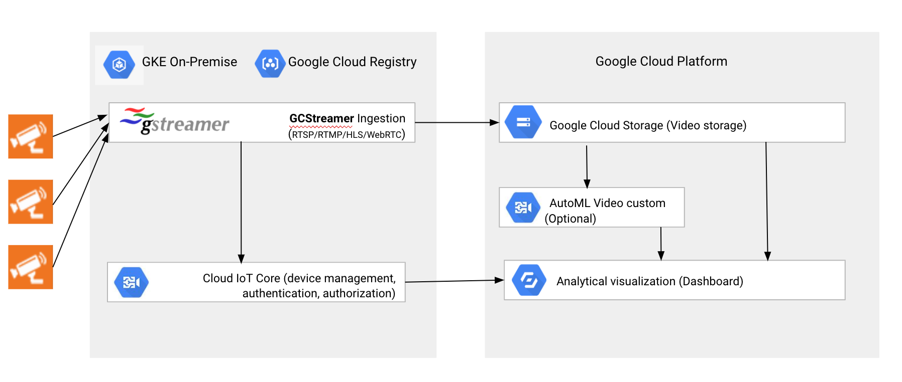

GCStreamer - A Media Streaming to Google Cloud Storage and Google Cloud IoT Core
===================================

GCStreamer is an open source media streaming and processing application used in conjunction with [Google Cloud Storage](https://cloud.google.com/storage/docs) to store video chunks and [Google Cloud IoT Core](https://cloud.google.com/iot/docs) to register device status.

[Google Cloud Storage](https://cloud.google.com/storage/docs) supports features like **Object Lifecycle Management**, whih allows to transition automatically to lower-cost storage classes when it meets specific criteria (for example, after 30 days).

GCStreamer can run on premises or in the clouds. 


|  | 
|:--:| 
| *Figure: GCStreamer architecture* |

<table>
  <tr>
    <td><b>Homepage:</b></td>
    <td><a href="https://cloud.google.com/storage/docs/">Google Cloud Storage</a></td>
  </tr>
  <tr>
    <td><b>Homepage:</b></td>
    <td><a href="https://cloud.google.com/iot/docs/">Google Cloud IoT Core</a></td>
  </tr>
    <tr>
    <td><b>Homepage:</b></td>
    <td><a href="https://gstreamer.freedesktop.org/">gStreamer</a></td>
  </tr>
</table>


GCStreamer ingestion pipeline is behaved as a streaming proxy, converting from live streaming procotols to chunk-based uploading. Additionally sends periodical status messages to Cloud IoT Core (connected/disconnected)

To support live streaming protocols, we utilize [gStreamer](https://gstreamer.freedesktop.org) open-source multimedia framework. Do not confuse gStreamer with GCStreamer (this app), we use both.


# Create new camera in Cloud IoT Core

You must have a Gloud IoT registry already created. Let's create a device (camera)

These commands create a public/private key pair:
```bash
openssl genpkey -algorithm RSA -out rsa_private.pem -pkeyopt rsa_keygen_bits:2048
openssl rsa -in rsa_private.pem -pubout -out rsa_public.pem
```

You will use the private key to call the docker, and the public key to create the device in the console.
To create the device with the previous public key `rsa_public.pem` (you can optionally set an expiration date)
```bash
export DEVICE_ID=<MY_DEVICE_ID>
gcloud iot devices create DEVICE_ID \
  --project=PROJECT_ID \
  --region=REGION \
  --registry=REGISTRY_ID \
  --public-key path=rsa_public.pem,type=rsa-x509-pem
```

# Create a GCS bucket for your videos

You must create a GCS bucket for your videos and mofidy [this line](https://github.com/rafaelsf80/gcstreamer/blob/main/client/gcstreamer.py#L16)

# Local execution (no Docker)

## Step 1: Create a named pipe

A named pipe is created to communicate between gStreamer and GCStreamer ingestion proxy. The two processes are running
inside the same Docker image.

```
export PIPE_NAME=/path_to_pipe/pipe_name
mkfifo $PIPE_NAME
```

## Step 2: Run GCStreamer ingestion proxy

Command line to run our example python code:

```bash
export GOOGLE_APPLICATION_CREDENTIALS=/path_to_credential/credential_json
export PIPE_NAME=/path_to_pipe/pipe_name
export TIMEOUT=3600 # future use
./gcstreamer.py --video_path=$PIPE_NAME 
```

Here, $GOOGLE_APPLICATION_CREDENTIALS specifies where GCP credential json file is located.

## Step 3: Run gStreamer pipeline

gStreamer supports multiple live streaming protocols including but not limited to:

* HTTP Live Streaming (HLS)
* Real-time Streaming Protocol (RTSP)
* Real-time Protocol (RTP)
* Real-time Messaging Protocol (RTMP)
* WebRTC
* Streaming from Webcam

We use gStreamer pipeline to convert from these live streaming protocols to a decodable video stream, and writes the stream into
the named pipe we create in Step 1.

Here, we only provide examples RTSP. If you need other protocol support, please contact us.
```bash
export PIPE_NAME=/path_to_pipe/pipe_name
export RTSP_SOURCE=rtsp://ip_addr:port/stream
gst-launch-1.0 -v rtspsrc location=$RTSP_SOURCE ! rtpjitterbuffer ! rtph264depay ! h264parse ! flvmux ! filesink location=$PIPE_NAME
# gst-launch-1.0 -v rtspsrc location=$RTSP_SOURCE ! rtpjitterbuffer ! rtph264depay \
#      ! h264parse ! mp4mux ! filesink location=$PIPE_NAME
```


# Docker deployment Local

This [docker example](https://github.com/rafaelsf80/gcstreamer/blob/main/env/Dockerfile) provides all dependencies configured. You can find the python files binary in $BIN_DIR directory of the docker image.

Run the following command line on your host machine:
```bash
export DOCKER_IMAGE=gcr.io/<YOUR_PROJECT_ID>/docker-gcstreamer:latest
export PRIVATE_KEY="$(cat ~/.rsa_private.pem)"
export RTSP_URL="rtsp://freja.hiof.no:1935/rtplive/definst/hessdalen03.stream" # PUBLIC URL
export DEVICE_ID=<YOUR_DEVICE_ID> # same as IoT core
export CAMERA_TYPE="STANDARD"
docker build -t $DOCKER_IMAGE -f env/Dockerfile .
docker run -it --network=host $DOCKER_IMAGE $PRIVATE_KEY $RTSP_URL $DEVICE_ID $CAMERA_TYPE  # run app
```

The `--network=host` argument is mandatory since Docker can change the source port of UDP packets for routing reasons, and this makes RTSP routing impossible. However, **note this only works in Linux**, not [Mac or Windows](https://stackoverflow.com/questions/54165483/docker-alternative-to-network-host-on-macos-and-windows).


# Docker deployment in Google Gloud Platform (GKE)

Push the previous Docker image to GCP container registry:
```bash
gcloud auth configure-docker
docker push $DOCKER_IMAGE # push to Google Container Registry
```

Run the following commands in your host machine (make sure you have a GKE cluster beforehand)
```bash
gcloud container clusters get-credentials <YOUR_GKE_CLUSTER_NAME> --zone=europe-west1-b
kubectl run camera-standard-type --image $DOCKER_IMAGE  -- $PRIVATE_KEY $RTSP_URL $DEVICE_ID $CAMERA_TYPE
```

To see the logs of the app, write the following:
```bash
kubectl get pods  # select the pod
kubectl logs -f camera-standard-type-7ff975cf4b-s2g26 # get logs
```

# Dashboard

You can view the videos uploaded with the nodejs dashboard. The following two commands will create the Docker, store it in Google Container Registry and create the Cloud Run service:
```bash
gcloud builds submit --tag gcr.io/<YOUR_PROJECT_ID>/videos-frontend
gcloud run deploy videos-frontend --image gcr.io/<YOUR_PROJECT_ID>/videos-frontend --allow-unauthenticated --region=europe-west1 --platform=managed
```


# Flow control

Google Cloud Storage does not provide flow control. It should be required to create some basic flow control, to cover these two cases:

1. when GCStreamer ingestion client is sending requests to Google servers too frequently
2. when GCStreamer ingestion client is sending too much data to Google servers (beyond 20Mbytes per second).

# Code architecture

GCStreamer ingestion  includes the following two directories:

* [client](client): Python client libraries for connecting to Cloud Storage and IoT Core.
* [env](env): Docker example for GCStreamer ingestion.

# Third-party dependency

The open source GCStreamer ingestion library is based on the following third-party open source libraries:

* [gStreamer](https://gstreamer.freedesktop.org): cross-platform multimedia processing and streaming framework.
